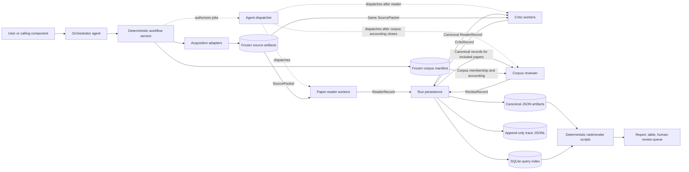
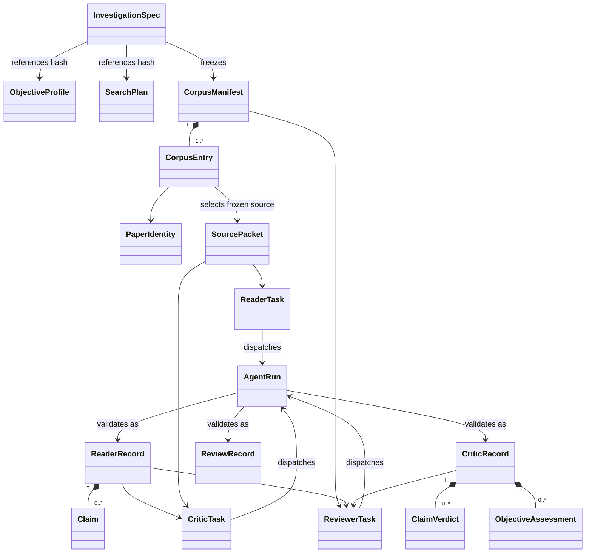
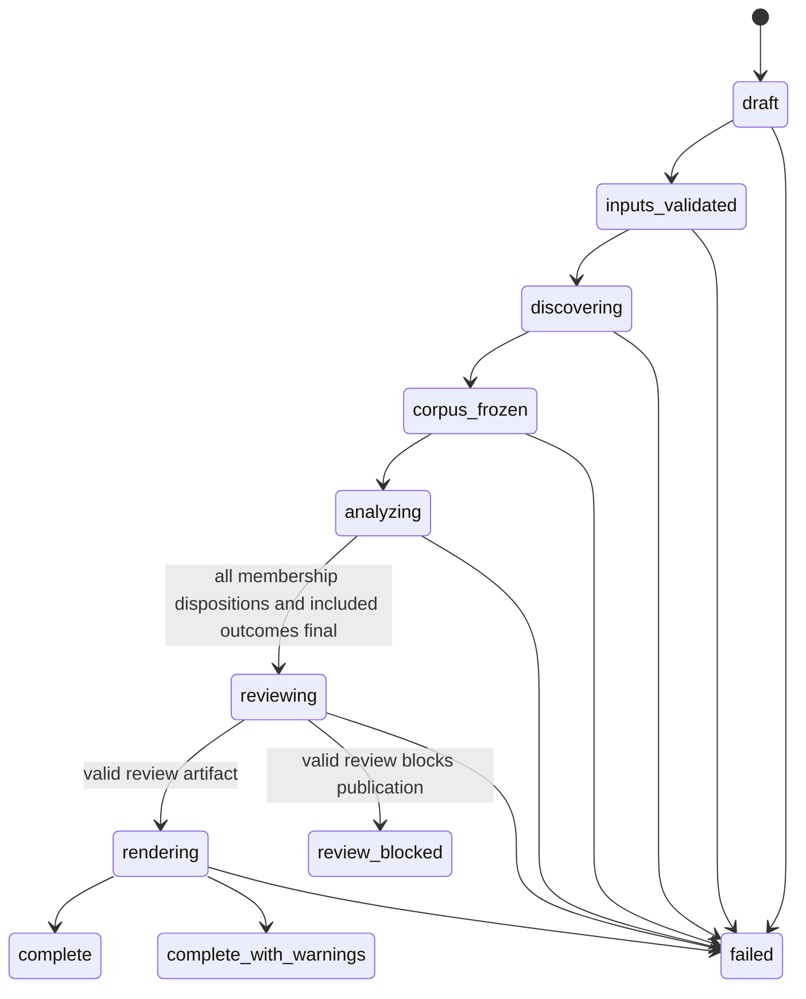
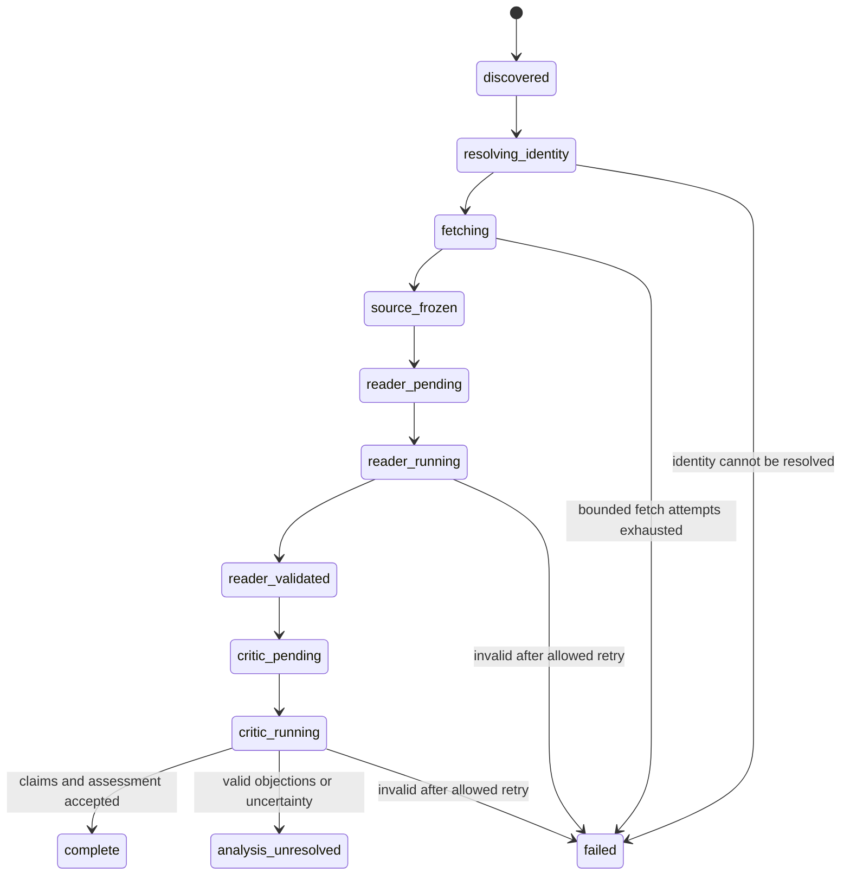
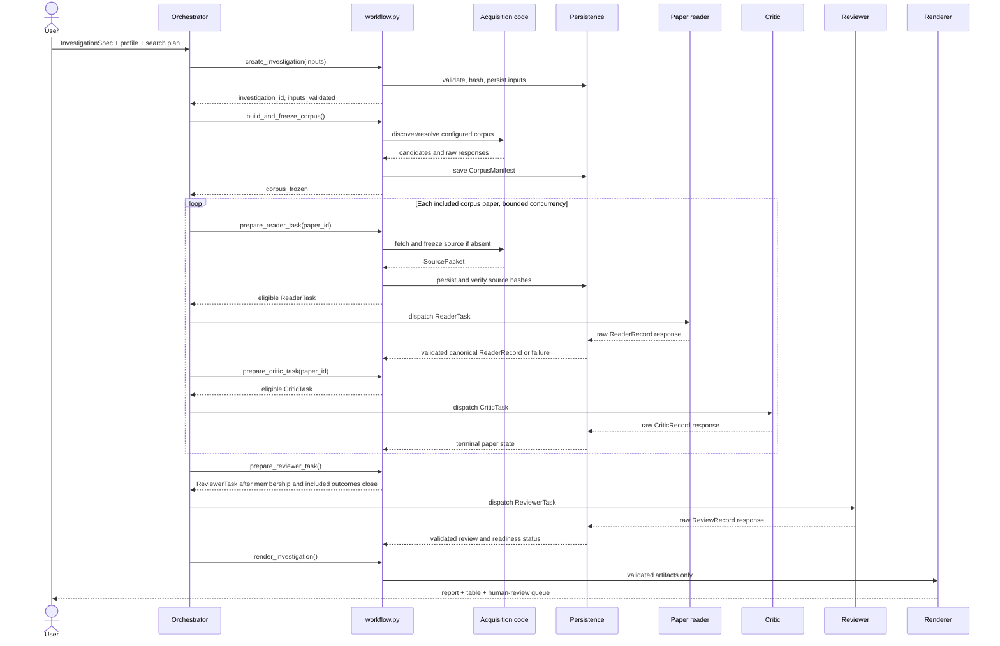
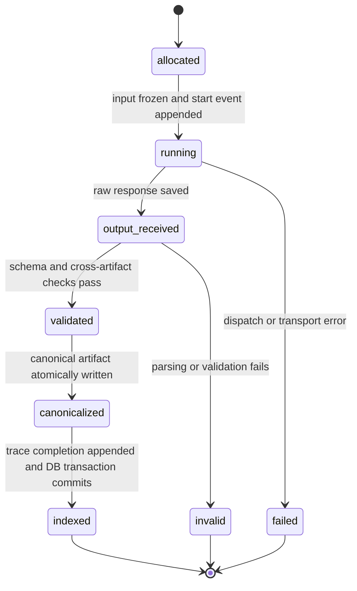
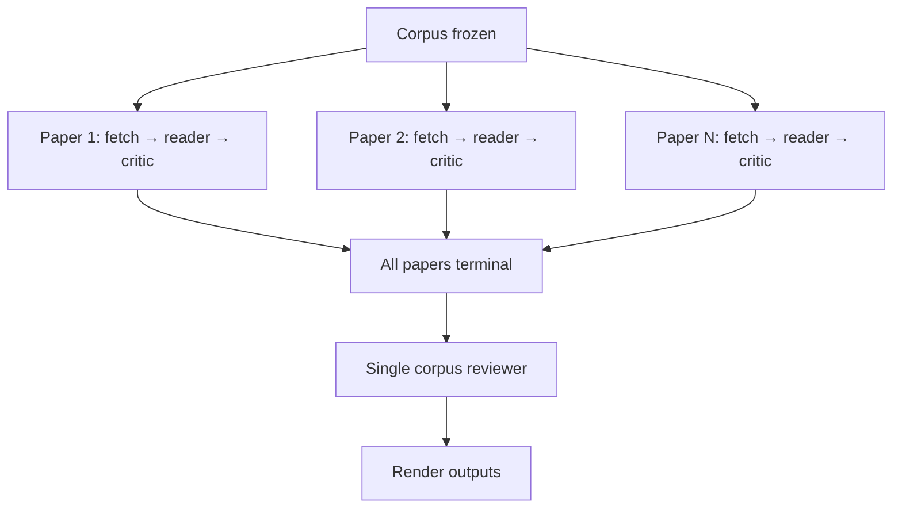
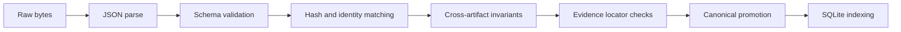

# Core Investigation Platform — Implementation Specification

Status: **Core contracts approved; agent behavior under review**

Implements: `docs/plans/01-core-investigation-platform.md`

Schema target: `2.0`

## 1. Purpose

This specification defines the infrastructure shared by every research
investigation, regardless of how its paper corpus is discovered or how papers
are scored. It covers:

- investigation and per-paper lifecycles
- orchestrator, paper-reader, critic, and reviewer boundaries
- object transfers between those roles
- source-before-reader enforcement
- agent-run persistence and tracing
- canonical artifact locations
- the rebuildable SQLite index
- concurrency, retry, recovery, and failure behavior
- implementation modules and test gates

It does not define workshop-page parsing, proposal conversion, web-search query
generation, or component-specific scoring rubrics. Those are layered onto these
contracts by later component specifications.

### Review map

Sections 3–6 define architecture and flow, section 9 defines agent-run
persistence, section 11 defines the rebuildable index, and section 22 records
the accepted architecture choices. Sections 7–8 are the exact object-transfer
contracts.

## 2. Design rules

1. JSON artifacts are the evidence source of truth. SQLite is a rebuildable
   index, not hidden workflow state.
2. A path locates bytes; a SHA-256 hash identifies the exact bytes used.
3. External retrieval and deterministic validation are implemented in code.
   Agents perform bounded reading, criticism, and corpus-level review.
4. The orchestrator requests transitions; `workflow.py` decides whether each
   transition is legal.
5. The reader never fetches. A reader task cannot be constructed until a frozen
   source packet exists and its hashes have been verified.
6. Each included corpus paper has one logical reader job and one logical critic job.
   Failed physical attempts remain visible and cannot create two canonical
   results.
7. The reviewer runs once per completed corpus and never edits reader or critic
   artifacts.
8. Every corpus member has one membership disposition. Every included member
   additionally finishes analysis as `complete`, `analysis_unresolved`, or
   `failed`. Nothing disappears because it was excluded, could not be routed,
   or failed during analysis.
9. Component skills may narrow attention and provide rubrics, but they cannot
   weaken source, provenance, isolation, schema, or failure-visibility rules.

## 3. Runtime topology



Dashed edges are dispatch control; solid edges are persisted data flow. The
reviewer is not launched alongside paper workers. It receives the frozen corpus
manifest plus every canonical reader and critic record after all included paper
chains reach a terminal analysis state and every corpus entry has a membership
disposition.

Independent paper chains run concurrently. Within one chain, the critic must
follow its reader because it critiques that reader's record. The corpus-level
barrier is therefore: parallel `(source → reader → critic)` chains → one
reviewer. Workers cannot message or spawn one another; artifacts move through
run persistence and are dispatched again by the orchestrator.

## 4. Role contracts

| Role | Cardinality | Input | Output | Explicit exclusions |
|---|---:|---|---|---|
| Orchestrator | 1 per investigation | Investigation inputs and workflow status | Dispatch requests and final completion request | Does not read papers, rewrite artifacts, or self-approve research conclusions |
| Paper reader | 1 logical job per paper | Frozen `ReaderTask` | `ReaderRecord` | No fetching, claim verification, corpus comparison, ranking, or global novelty claim |
| Critic | 1 logical job per paper | Frozen `CriticTask` | `CriticRecord` | No record rewriting, corpus-wide comparison, or final report generation |
| Reviewer | 1 logical job per investigation | Frozen `ReviewerTask` | `ReviewRecord` | No fetching, paper rereading, silent correction, or removal of failures |

The reviewer owns corpus-level comparison and report readiness. This keeps the
orchestrator a controller instead of making it both author and judge of the
final synthesis.

## 5. Core object graph



## 6. Investigation lifecycle

### 6.1 Investigation states



`failed` at investigation level is reserved for an infrastructure or contract
failure that prevents an honest report. Individual paper failures normally lead
to `complete_with_warnings`, provided they remain visible and the reviewer does
not block publication. `review_blocked` records a valid reviewer decision that
an honest report is not ready; it is distinct from infrastructure or contract
failure and cannot transition to rendering without a separately defined
resolution workflow.

### 6.2 Per-paper states



### 6.3 Investigation flow



## 7. Universal input contracts

These summaries establish implementation shape. `docs/schema.md` will contain
the normative JSON Schema/Pydantic definitions when implementation begins.

Core `2.0` identifiers start with a lowercase ASCII letter and continue with
lowercase letters or digits separated by single `-`, `_`, `.`, or `:`
characters. Paths are normalized repository-relative POSIX paths without dot
segments or backslashes. Artifact timestamps are RFC 3339 UTC strings with the
canonical `Z` suffix.

Every object that stores its own hash uses the same construction: canonical
compact JSON, lexicographically sorted object keys, arrays in source order,
direct non-ASCII output, no trailing newline, UTF-8 encoding, with only the
object's own hash field excluded. This applies to `spec_hash`, `profile_hash`,
`search_plan_hash`, `corpus_hash`, `identity_hash`, `packet_hash`, and worker
task `input_hash`. Result-record `input_hash` values reference and must equal
the dispatched task self-hash.

### 7.1 `InvestigationSpec`

```json
{
  "schema_version": "2.0",
  "investigation_id": "inv-20260912-01a2b3c4",
  "kind": "component-defined-string",
  "question": "User-facing investigation question",
  "scope": {},
  "requested_outputs": ["report", "papers_csv"],
  "uncertainty_policy": "escalate",
  "created_at": "2026-09-12T18:00:00Z",
  "spec_hash": "64-lowercase-hex"
}
```

Core validates structure and hashes. `requested_outputs` is a unique non-empty
subset of `report` and `papers_csv`; `uncertainty_policy` is `escalate`. The
component owns the contents of `scope`, subject to a component schema version.

### 7.2 `ObjectiveProfile`

```json
{
  "schema_version": "2.0",
  "profile_id": "profile-example-v1",
  "component": "component-defined-string",
  "origin": "user_authored",
  "criteria": [
    {
      "criterion_id": "example",
      "definition": "What is being judged",
      "score_type": "integer_0_5",
      "weight": 1.0,
      "gate": false,
      "anchors": {"0": "Absent", "3": "Moderate", "5": "Strong"}
    }
  ],
  "human_review_triggers": ["uncertain_high_impact"],
  "profile_hash": "64-lowercase-hex"
}
```

Every criterion has a stable ID, operational definition, and score anchors.
The core ranker accepts only declared criteria.

### 7.3 `SearchPlan`

```json
{
  "schema_version": "2.0",
  "search_plan_id": "search-example-v1",
  "component": "component-defined-string",
  "providers": [],
  "inclusion_rules": [],
  "exclusion_rules": [],
  "completion_rule": {},
  "budget": {},
  "search_plan_hash": "64-lowercase-hex"
}
```

The core treats provider configuration as typed component data. It requires an
explicit completion rule and budget; it does not define search semantics.

### 7.4 `CorpusManifest`

```json
{
  "schema_version": "2.0",
  "investigation_id": "inv-20260912-01a2b3c4",
  "search_plan_hash": "64-lowercase-hex",
  "frozen_at": "2026-09-12T18:05:00Z",
  "entries": [
    {
      "ordinal": 1,
      "paper_id": "paper-9a45d231",
      "membership_status": "included",
      "discovery_refs": ["discovery-event-id"],
      "inclusion_reason": "component-defined reason",
      "exclusion_reason": null,
      "terminal_state": null
    }
  ],
  "counts": {
    "discovered": 1,
    "included": 1,
    "excluded": 0,
    "membership_unresolved": 0
  },
  "corpus_hash": "64-lowercase-hex"
}
```

The corpus is the complete frozen, deduplicated set of discovered candidates.
Raw provider hits and duplicate observations remain in the append-only
discovery ledger and are linked through `discovery_refs`; they do not create
additional manifest entries or inflate `counts.discovered` (and therefore do
not inflate reviewer `expected`).

Each entry has exactly one `membership_status`: `included`, `excluded`, or
`membership_unresolved`. `membership_unresolved` is reserved for discovery or
identity cases that cannot be routed. A conservative screener result of
`needs_review` maps to `included` and proceeds to analysis. Included entries
require a non-null `inclusion_reason`; excluded entries require a non-null
`exclusion_reason`. Membership-unresolved entries keep both reason fields null;
their details remain in the referenced discovery artifact.

The frozen manifest must satisfy:

```text
counts.discovered = len(entries)
counts.discovered = counts.included + counts.excluded + counts.membership_unresolved
```

The initial manifest is immutable. Analysis outcomes for included entries are
recorded in separate paper-state artifacts and projected into reports; the
manifest itself is not rewritten during analysis. Excluded and
membership-unresolved entries never receive reader or critic jobs.

### 7.5 `PaperIdentity`

```json
{
  "schema_version": "2.0",
  "paper_id": "paper-9a45d231",
  "title": "Exact resolved title",
  "authors": ["Author One"],
  "published": null,
  "identifiers": [
    {"scheme": "arxiv", "value": "2601.01234v1", "url": "https://arxiv.org/abs/2601.01234"}
  ],
  "identity_status": "resolved_exact",
  "identity_hash": "64-lowercase-hex"
}
```

`paper_id` is internal and stable. arXiv, DOI, OpenReview, and URLs are
identifiers, not primary keys.

### 7.6 `SourcePacket`

```json
{
  "schema_version": "2.0",
  "source_document_id": "src-36b7c20d",
  "paper_id": "paper-9a45d231",
  "format": "html",
  "retrieval_method": "direct",
  "source_url": "https://arxiv.org/html/2601.01234v1",
  "retrieved_at": "2026-09-12T18:06:00Z",
  "original_path": "data/papers/paper-9a45d231/sources/src-36b7c20d/original.html",
  "original_sha256": "64-lowercase-hex",
  "normalized_path": "data/papers/paper-9a45d231/sources/src-36b7c20d/normalized.txt",
  "normalized_sha256": "64-lowercase-hex",
  "sections": [
    {
      "section_id": "sec-0001",
      "heading": "Abstract",
      "start_char": 0,
      "end_char": 523
    }
  ],
  "warnings": [],
  "packet_hash": "64-lowercase-hex"
}
```

Offsets address the UTF-8-decoded normalized text in Python string code points.
The validator reconstructs every claim quote from `start_char:end_char` and
requires exact equality.

Source `format` is `html`, `pdf_text`, or `abstract`. `retrieval_method` is
`direct` or `fallback`; `source_url` may be null when no stable retrieval URL
is available. Paper `identity_status` is `unresolved`, `resolved_exact`,
`resolved_probable`, or `ambiguous`.

## 8. Worker transfer contracts

### 8.1 `ReaderTask`

```json
{
  "schema_version": "2.0",
  "job_type": "paper_read",
  "agent_run_id": "run-reader-a1b2c3",
  "investigation_id": "inv-20260912-01a2b3c4",
  "paper_identity": {},
  "source_packet": {},
  "source_text": "Exact UTF-8-decoded normalized source text",
  "focus": {
    "component": "component-defined-string",
    "skill_hash": null,
    "questions": []
  },
  "output_schema_version": "2.0",
  "input_hash": "64-lowercase-hex"
}
```

The task embeds the exact frozen packet and normalized `source_text`; the
UTF-8 SHA-256 of `source_text` must equal
`source_packet.normalized_sha256`. The reader therefore needs no file or
network tool. It receives focus questions, not ranking weights or a desired
conclusion. `input_hash` is the task self-hash excluding only that field.

### 8.2 `ReaderRecord`

```json
{
  "schema_version": "2.0",
  "role": "paper_reader",
  "job_type": "paper_read",
  "agent_run_id": "run-reader-a1b2c3",
  "investigation_id": "inv-20260912-01a2b3c4",
  "paper_id": "paper-9a45d231",
  "source_document_id": "src-36b7c20d",
  "input_hash": "64-lowercase-hex",
  "problem": "Concise problem statement",
  "method": "Concise method statement",
  "claims": [
    {
      "claim_id": "claim-0c43e12a",
      "claim_kind": "result",
      "text": "Bounded formulation of the paper's result",
      "source_locator": {
        "document_sha256": "64-lowercase-hex",
        "section_id": "sec-0004",
        "start_char": 2054,
        "end_char": 2182,
        "quote": "Exact normalized source substring"
      },
      "evidence_modality": "experiment",
      "execution_environment": "real_hardware",
      "provenance": "paper_stated",
      "status": "unverified"
    }
  ],
  "warnings": []
}
```

Core enums:

- `claim_kind`: `problem`, `method`, `contribution`, `result`, `limitation`,
  `assumption`, `novelty_claim`
- `evidence_modality`: `experiment`, `simulation`, `theory`, `observational`,
  `qualitative`, `none_stated`
- `execution_environment`: `real_hardware`, `simulated_hardware`,
  `software_runtime`, `dataset_only`, `not_applicable`, `none_stated`
- `provenance`: `paper_stated`, `analyst_inferred`

This is the complete top-level reader contract. The universal record does not
contain `contributions`, `experimental_evidence`, `limitations`, `assumptions`,
or `focused_observations`. Evidence-bearing contributions, methods, results,
problems, and limitations use the single `claims` collection. Component focus
questions guide claim extraction but do not create another canonical result
collection.

`claims` may be empty. An empty collection is valid when the frozen source has
no extractable relevant claim; the reader must not invent filler to meet a
minimum cardinality. `warnings` is an array of non-empty strings that keeps the
reason or any degraded source condition visible, and it must contain at least
one item when `claims` is empty. The critic's
one-verdict-per-claim invariant therefore permits an empty `verdicts` array for
an empty reader record.

An inferred claim has no source locator, uses `none_stated` evidence, and cannot
be marked supported. Prefer later objective assessments over inferred paper
claims.

Reader output is admitted through one deterministic validation gateway that
accepts the exact task and raw output. That gateway owns parsing,
top-level and claim structure, identity and hash matching, cross-artifact
invariants, and exact locator reconstruction before canonical promotion. It may
be internally decomposed, but callers do not validate or promote reader
fragments independently. Locator reconstruction uses `task.source_text`. The
critic, not this gateway, judges semantic support.

### 8.3 `CriticTask`

```json
{
  "schema_version": "2.0",
  "job_type": "paper_critique",
  "agent_run_id": "run-critic-d4e5f6",
  "investigation_id": "inv-20260912-01a2b3c4",
  "paper_identity": {},
  "source_packet": {},
  "source_text": "Exact UTF-8-decoded normalized source text",
  "reader_record": {},
  "objective_profile": {},
  "critic_rubric": {
    "component": "component-defined-string",
    "skill_hash": null
  },
  "input_hash": "64-lowercase-hex"
}
```

The critic receives the same source representation: the UTF-8 SHA-256 of its
embedded `source_text` must equal `source_packet.normalized_sha256`. It sees no
reader reasoning transcript, preliminary rank, reviewer opinion, or desired
outcome. `input_hash` is the task self-hash excluding only that field.

### 8.4 `CriticRecord`

```json
{
  "schema_version": "2.0",
  "role": "critic",
  "job_type": "paper_critique",
  "agent_run_id": "run-critic-d4e5f6",
  "investigation_id": "inv-20260912-01a2b3c4",
  "paper_id": "paper-9a45d231",
  "reader_run_id": "run-reader-a1b2c3",
  "input_hash": "64-lowercase-hex",
  "verdicts": [
    {
      "claim_id": "claim-0c43e12a",
      "status": "supported",
      "evidence_classification_correct": true,
      "reason": "The exact span supports the bounded claim."
    }
  ],
  "objective_assessments": [
    {
      "criterion_id": "example",
      "score": 3,
      "reason": "Assessment bounded to the supplied profile.",
      "evidence_claim_ids": ["claim-0c43e12a"],
      "assumptions": [],
      "uncertain": false
    }
  ],
  "human_review_reasons": []
}
```

Verdict status is `supported`, `unsupported`, or `overclaimed`. Every reader
claim receives exactly one verdict. Assessments may cite only claims marked
`supported` in the same critic record. Every declared objective criterion has
exactly one assessment. Core `2.0` defines only `integer_0_5`, so `score` is a
required integer and `label` is not a field. Human review is derived from a
non-empty `human_review_reasons` array; no duplicate boolean is serialized.
One `validate_critic_output(task, raw_output)` gateway owns parsing and every
task/result relationship check.

### 8.5 `ReviewerTask` and `ReviewRecord`

`ReviewerTask` contains exactly:

```json
{
  "schema_version": "2.0",
  "job_type": "corpus_review",
  "agent_run_id": "run-reviewer-g7h8i9",
  "investigation_id": "inv-20260912-01a2b3c4",
  "investigation_spec": {},
  "objective_profile": {},
  "search_plan": {},
  "corpus_manifest": {},
  "corpus_accounting": {},
  "papers": [
    {
      "paper_id": "paper-9a45d231",
      "analysis_status": "complete",
      "reader_record": {},
      "critic_record": {}
    }
  ],
  "ranking_artifact": null,
  "reviewer_rubric": {
    "component": "component-defined-string",
    "skill_hash": null
  },
  "input_hash": "64-lowercase-hex"
}
```

The four embedded universal artifacts retain and verify their own hashes. The
task contains exactly one `papers` item per included corpus entry. A complete
or analysis-unresolved item requires both canonical records; a failed item has
no critic and may retain a reader. `ranking_artifact` is component-owned and is
validated by that component before dispatch. The task self-hash excludes only
`input_hash`.

It does not include hidden worker reasoning or mutable conversation history.

`ReviewRecord` contains:

```json
{
  "schema_version": "2.0",
  "role": "reviewer",
  "job_type": "corpus_review",
  "agent_run_id": "run-reviewer-g7h8i9",
  "investigation_id": "inv-20260912-01a2b3c4",
  "input_hash": "64-lowercase-hex",
  "corpus_accounting": {
    "expected": 1,
    "included": 1,
    "excluded": 0,
    "membership_unresolved": 0,
    "complete": 1,
    "analysis_unresolved": 0,
    "failed": 0
  },
  "findings": [
    {
      "finding_id": "finding-1a2b3c4d",
      "text": "Corpus-level bounded finding",
      "evidence_refs": [
        {
          "kind": "claim",
          "paper_id": "paper-9a45d231",
          "claim_id": "claim-0c43e12a"
        }
      ],
      "provenance": "reviewer_inferred",
      "uncertain": false
    }
  ],
  "challenges": [
    {
      "challenge_id": "challenge-1a2b3c4d",
      "target": {
        "kind": "verdict",
        "paper_id": "paper-9a45d231",
        "claim_id": "claim-0c43e12a"
      },
      "text": "Bounded corpus-review objection",
      "evidence_refs": [],
      "uncertain": true
    }
  ],
  "human_review_items": [],
  "report_status": "ready_with_warnings"
}
```

`report_status` is `ready`, `ready_with_warnings`, or `blocked`. A reviewer may
challenge a ranking or conclusion but may not replace its underlying artifacts.
`expected` equals `CorpusManifest.counts.discovered`, the number of frozen,
deduplicated corpus entries, including excluded and membership-unresolved
candidates. The accounting is valid only when all invariants hold:

```text
expected = CorpusManifest.counts.discovered
expected = included + excluded + membership_unresolved
included = complete + analysis_unresolved + failed
```

Excluded and membership-unresolved entries are represented by their corpus
membership records, not fabricated reader or critic artifacts.

Accounting validity is enforced by rejecting a record that violates either
equation; `accounting_valid` is not serialized. Evidence references are typed
objects: claims and verdicts use `kind`, `paper_id`, and `claim_id`; assessments use
`kind`, `paper_id`, and `criterion_id`; corpus entries use `kind` plus
`paper_id`. A finding requires at least one resolvable evidence reference. A
challenge contains its own ID, typed target, text, optional supporting evidence
references, and uncertainty flag. `human_review_items` contains unique
challenge IDs rather than duplicating challenge content. Non-empty human-review
items derive `blocked`; otherwise any challenge or unresolved/failed count
derives `ready_with_warnings`; otherwise status is `ready`. One
`validate_reviewer_output(task, raw_output)` gateway owns parsing, binding,
accounting, and reference resolution.

## 9. Agent-run persistence

### 9.1 Run states



`invalid` is a terminal physical-run outcome. It records that output arrived but
failed parsing or deterministic validation and is not followed by
`agent_run.failed` for the same attempt. If the logical job remains eligible,
the workflow allocates a new `agent_run_id` with `attempt_no + 1`. Exhausting
the retry allowance may fail the logical job and its paper or investigation;
it does not rewrite the final status of an invalid physical attempt.

### 9.2 Save sequence

```mermaid
sequenceDiagram
    participant O as Orchestrator
    participant W as workflow.py
    participant FS as Artifact store
    participant T as trace.jsonl
    participant A as Agent dispatcher
    participant V as validate.py
    participant DB as SQLite index

    O->>W: dispatch(job_type, scope)
    W->>W: check transition and uniqueness
    W->>FS: create run directory; atomically write input.json
    W->>T: append agent_run.started
    W->>DB: index running attempt
    W->>A: invoke worker with exact input bytes

    alt Agent returns bytes
        A-->>W: raw response + usage
        W->>FS: atomically write raw-output.txt
        W->>V: parse and validate against frozen inputs
        V->>FS: write validation.json
        alt Valid
            V->>FS: write parsed.json
            W->>FS: atomically write canonical role artifact
            W->>T: append agent_run.completed
            W->>DB: transactionally index artifact and child records
        else Invalid and retry remains
            W->>T: append agent_run.invalid
            W->>DB: index terminal invalid attempt
            W-->>O: correction retry eligible
        else Invalid and retry exhausted
            W->>T: append agent_run.invalid
            W->>DB: index terminal invalid attempt
            W-->>O: mark logical job and paper or investigation failed
        end
    else Dispatch fails
        A-->>W: error without output
        W->>FS: write outcome.json with error
        W->>T: append agent_run.failed
        W->>DB: index failed attempt
    end
```

### 9.3 On-disk run bundle

Every physical invocation gets its own immutable directory:

```text
runs/<agent-run-id>/
  input.json          canonical task bytes supplied to the worker
  raw-output.txt      exact worker response, absent only if no response arrived
  parsed.json         parsed JSON before canonical promotion, when parsing succeeds
  validation.json     validator version, checks, errors, and referenced hashes
  outcome.json        final run status, timing, usage, artifact hashes, and error
```

Files are written through a temporary sibling and promoted with `os.replace`.
The canonical role artifact is a byte-for-byte copy of `parsed.json` after all
validation passes:

```text
papers/<paper-id>/reader/canonical.json
papers/<paper-id>/critic/canonical.json
review/canonical.json
```

No failed or invalid response is promoted. Canonical promotion fails if a
canonical artifact already exists for a different validated input hash.

#### Exact run-bundle record contracts

`AgentRun` is the complete physical-attempt projection and contains:

```text
schema_version, agent_run_id, investigation_id, paper_id, role, job_type,
attempt_no, status, model, agent_definition_hash, component_skill_hash,
objective_profile_hash, input_path, input_hash, raw_output_path,
raw_output_hash, validation_path, validation_hash, canonical_path,
canonical_hash, started_at, completed_at, duration_ms, tokens_in, tokens_out,
cost_usd, error
```

Role/job pairs are `paper_reader`/`paper_read`, `critic`/`paper_critique`, and
`reviewer`/`corpus_review`; paper roles require `paper_id`, while corpus roles
require null. Attempt is 1 or 2. Status is `running`, `output_received`,
`invalid`, `completed`, `failed`, or `interrupted`. Each artifact path and hash
is an all-or-null pair. Terminal states require `completed_at` and
`duration_ms`. Completed runs require raw, validation, and canonical artifacts
and no error. Invalid runs require raw and validation artifacts plus an error,
and forbid canonical output. Failed runs have no returned artifacts and require
an error. Interrupted runs require an error and cannot be canonical.

`validation.json` contains:

```json
{
  "schema_version": "2.0",
  "agent_run_id": "run-reader-a1b2c3",
  "validator_version": "exact-validator-version",
  "checked_at": "2026-09-12T18:10:05Z",
  "input_hash": "64-lowercase-hex",
  "parsed_hash": "64-lowercase-hex-or-null",
  "checks": [
    {"check_id": "schema", "status": "passed", "detail": null}
  ],
  "errors": [],
  "referenced_hashes": [
    {"name": "source.packet", "sha256": "64-lowercase-hex"}
  ]
}
```

Checks and referenced-hash names are unique. Check status is `passed` or
`failed`; a failed check requires detail. `errors` is non-empty exactly when a
check failed. Successful validation requires `parsed_hash`. Validation pass is
therefore derived and is not serialized as another boolean.

`outcome.json` contains schema/run identity, terminal `status`, `started_at`,
`completed_at`, `duration_ms`, input path/hash, raw/validation/canonical
path-hash pairs, tokens, cost, and error. Its terminal artifact and error rules
are identical to `AgentRun`. Usage values are nullable and non-negative.

### 9.4 Trace events

Version `2.0` changes the trace from one final row per dispatch to an append-only
lifecycle event stream. This makes interrupted runs observable.

Every event contains:

```json
{
  "schema_version": "2.0",
  "event_id": "evt-unique-id",
  "event_type": "agent_run.started",
  "timestamp": "2026-09-12T18:10:00Z",
  "agent_run_id": "run-reader-a1b2c3",
  "investigation_id": "inv-20260912-01a2b3c4",
  "paper_id": "paper-9a45d231",
  "role": "paper_reader",
  "job_type": "paper_read",
  "attempt_no": 1,
  "sequence": 1,
  "model": "exact-model-id",
  "agent_definition_hash": "64-lowercase-hex",
  "component_skill_hash": null,
  "objective_profile_hash": "64-lowercase-hex",
  "input_path": "relative/path/to/input.json",
  "input_hash": "64-lowercase-hex",
  "artifact_path": null,
  "artifact_hash": null,
  "tokens_in": null,
  "tokens_out": null,
  "cost_usd": null,
  "error": null
}
```

Permitted event types:

- `agent_run.started`
- `agent_run.output_received`
- `agent_run.invalid`
- `agent_run.completed`
- `agent_run.failed`
- `agent_run.reconciled`

Trace events use the same role/job/scope rules and repository-relative path,
hash, timestamp, usage, and error types. `agent_run.started` has sequence 1.
Completed and reconciled events require an artifact path/hash and no error;
invalid and failed events require an error and no artifact. Output-received
events contain neither a canonical artifact nor an error.

The trace appender locks the file for one line, writes UTF-8 JSON plus newline,
flushes, and calls `fsync`. `event_id` and
`agent_run_id + event_type + sequence` are idempotency keys during database
rebuilding.

### 9.5 Crash recovery

`reconcile.py` compares run directories, trace events, canonical artifacts, and
SQLite rows:

- A start event without an outcome becomes `interrupted` and is eligible for a
  bounded retry.
- A validated run with a canonical artifact but no completion event receives a
  `reconciled` event after hashes are rechecked.
- A trace completion missing from SQLite is re-indexed.
- A SQLite row with no supporting artifact or trace is an integrity error; it
  is never treated as evidence.
- Reconciliation never invents missing model output.

## 10. Canonical filesystem layout

```text
data/
  objective-profiles/
    <profile-hash>.json
  search-plans/
    <search-plan-hash>.json
  papers/
    <paper-id>/
      identity.json
      sources/<source-document-id>/
        source-packet.json
        original.<ext>
        normalized.txt
  investigations/
    <investigation-id>/
      investigation.json
      corpus.json
      discovery/
        raw/<discovery-event-id>.*
        attempts/<attempt-id>/
      paper-state/<paper-id>.json
      papers/<paper-id>/
        reader/canonical.json
        critic/canonical.json
      review/canonical.json
      runs/<agent-run-id>/
        input.json
        raw-output.txt
        parsed.json
        validation.json
        outcome.json

logs/
  trace.jsonl

out/
  <investigation-id>/
    report.md
    papers.csv
    human-review.json

data/triage.db
```

Globally cached paper sources are immutable and addressed by source-document
ID and hash. Investigation directories contain the exact reader and critic
results produced under that investigation's focus, skill, and objective
profile.

All paths stored inside JSON or SQLite are repository-relative POSIX paths.

## 11. SQLite index

### 11.1 Storage policy

- Canonical JSON, source files, and trace events remain authoritative.
- SQLite is updated only after filesystem artifacts are durable.
- One process serializes SQLite writes; worker execution may remain parallel.
- Enable foreign keys, WAL mode, and a bounded busy timeout.
- `rebuild-db` deletes no artifacts and reconstructs the index from disk.

### 11.2 Proposed schema

```sql
PRAGMA foreign_keys = ON;
PRAGMA journal_mode = WAL;
PRAGMA busy_timeout = 5000;

CREATE TABLE objective_profiles (
    profile_hash       TEXT PRIMARY KEY,
    profile_id         TEXT NOT NULL,
    schema_version     TEXT NOT NULL,
    component          TEXT NOT NULL,
    origin             TEXT NOT NULL,
    artifact_path      TEXT NOT NULL UNIQUE,
    created_at         TEXT NOT NULL
);

CREATE TABLE search_plans (
    search_plan_hash   TEXT PRIMARY KEY,
    search_plan_id     TEXT NOT NULL,
    schema_version     TEXT NOT NULL,
    component          TEXT NOT NULL,
    artifact_path      TEXT NOT NULL UNIQUE,
    created_at         TEXT NOT NULL
);

CREATE TABLE investigations (
    investigation_id       TEXT PRIMARY KEY,
    schema_version         TEXT NOT NULL,
    kind                   TEXT NOT NULL,
    question               TEXT NOT NULL,
    status                 TEXT NOT NULL CHECK (status IN (
        'draft', 'inputs_validated', 'discovering', 'corpus_frozen',
        'analyzing', 'reviewing', 'review_blocked', 'rendering', 'complete',
        'complete_with_warnings', 'failed'
    )),
    spec_path              TEXT NOT NULL UNIQUE,
    spec_hash              TEXT NOT NULL,
    profile_hash           TEXT NOT NULL REFERENCES objective_profiles(profile_hash),
    search_plan_hash       TEXT NOT NULL REFERENCES search_plans(search_plan_hash),
    corpus_path            TEXT,
    corpus_hash            TEXT,
    created_at             TEXT NOT NULL,
    completed_at           TEXT
);

CREATE TABLE papers (
    paper_id            TEXT PRIMARY KEY,
    schema_version      TEXT NOT NULL,
    title               TEXT NOT NULL,
    authors_json        TEXT NOT NULL,
    published           TEXT,
    identity_status     TEXT NOT NULL CHECK (identity_status IN (
        'unresolved', 'resolved_exact', 'resolved_probable', 'ambiguous'
    )),
    identity_path       TEXT NOT NULL UNIQUE,
    identity_hash       TEXT NOT NULL
);

CREATE TABLE paper_identifiers (
    paper_id            TEXT NOT NULL REFERENCES papers(paper_id),
    scheme              TEXT NOT NULL CHECK (scheme IN (
        'arxiv', 'doi', 'openreview', 'url', 'proceedings'
    )),
    value               TEXT NOT NULL,
    url                 TEXT,
    PRIMARY KEY (paper_id, scheme, value),
    UNIQUE (scheme, value)
);

CREATE TABLE source_documents (
    source_document_id  TEXT PRIMARY KEY,
    paper_id            TEXT NOT NULL REFERENCES papers(paper_id),
    status              TEXT NOT NULL CHECK (status IN ('frozen', 'failed')),
    format              TEXT NOT NULL,
    retrieval_method    TEXT NOT NULL,
    source_url          TEXT,
    packet_path         TEXT NOT NULL UNIQUE,
    packet_hash         TEXT NOT NULL,
    original_path       TEXT,
    original_sha256     TEXT,
    normalized_path     TEXT,
    normalized_sha256   TEXT,
    retrieved_at        TEXT NOT NULL,
    error               TEXT,
    UNIQUE (paper_id, packet_hash)
);

CREATE TABLE corpus_membership (
    investigation_id   TEXT NOT NULL REFERENCES investigations(investigation_id),
    paper_id            TEXT NOT NULL REFERENCES papers(paper_id),
    ordinal             INTEGER NOT NULL,
    membership_status  TEXT NOT NULL CHECK (membership_status IN (
        'included', 'excluded', 'membership_unresolved'
    )),
    terminal_state     TEXT CHECK (terminal_state IN (
        'complete', 'analysis_unresolved', 'failed'
    )),
    source_document_id TEXT REFERENCES source_documents(source_document_id),
    inclusion_reason   TEXT,
    exclusion_reason   TEXT,
    state_path         TEXT,
    PRIMARY KEY (investigation_id, paper_id),
    UNIQUE (investigation_id, ordinal)
);

CREATE TABLE agent_runs (
    agent_run_id           TEXT PRIMARY KEY,
    investigation_id      TEXT NOT NULL REFERENCES investigations(investigation_id),
    paper_id               TEXT REFERENCES papers(paper_id),
    role                   TEXT NOT NULL CHECK (role IN (
        'paper_reader', 'critic', 'reviewer'
    )),
    job_type               TEXT NOT NULL,
    attempt_no             INTEGER NOT NULL CHECK (attempt_no BETWEEN 1 AND 2),
    status                 TEXT NOT NULL CHECK (status IN (
        'running', 'output_received', 'invalid', 'completed', 'failed', 'interrupted'
    )),
    model                  TEXT NOT NULL,
    agent_definition_hash  TEXT NOT NULL,
    component_skill_hash   TEXT,
    objective_profile_hash TEXT REFERENCES objective_profiles(profile_hash),
    input_path             TEXT NOT NULL,
    input_hash             TEXT NOT NULL,
    raw_output_path        TEXT,
    raw_output_hash        TEXT,
    validation_path        TEXT,
    validation_hash        TEXT,
    canonical_path         TEXT,
    canonical_hash         TEXT,
    started_at             TEXT NOT NULL,
    completed_at           TEXT,
    duration_ms            INTEGER,
    tokens_in              INTEGER,
    tokens_out             INTEGER,
    cost_usd               REAL,
    error                  TEXT,
    UNIQUE (investigation_id, paper_id, job_type, attempt_no)
);

CREATE UNIQUE INDEX one_corpus_job_attempt
ON agent_runs(investigation_id, job_type, attempt_no)
WHERE paper_id IS NULL;

CREATE TABLE reader_records (
    reader_record_id    TEXT PRIMARY KEY,
    agent_run_id        TEXT NOT NULL UNIQUE REFERENCES agent_runs(agent_run_id),
    investigation_id   TEXT NOT NULL REFERENCES investigations(investigation_id),
    paper_id            TEXT NOT NULL REFERENCES papers(paper_id),
    source_document_id  TEXT NOT NULL REFERENCES source_documents(source_document_id),
    input_hash          TEXT NOT NULL,
    artifact_path       TEXT NOT NULL UNIQUE,
    artifact_hash       TEXT NOT NULL,
    UNIQUE (investigation_id, paper_id)
);

CREATE TABLE claims (
    reader_record_id      TEXT NOT NULL REFERENCES reader_records(reader_record_id),
    claim_id              TEXT NOT NULL,
    claim_index           INTEGER NOT NULL,
    claim_kind            TEXT NOT NULL,
    text                  TEXT NOT NULL,
    document_sha256       TEXT,
    section_id            TEXT,
    start_char            INTEGER,
    end_char              INTEGER,
    source_quote          TEXT,
    evidence_modality     TEXT NOT NULL,
    execution_environment TEXT NOT NULL,
    provenance            TEXT NOT NULL,
    PRIMARY KEY (reader_record_id, claim_id),
    UNIQUE (reader_record_id, claim_index)
);

CREATE TABLE critic_records (
    critic_record_id    TEXT PRIMARY KEY,
    agent_run_id        TEXT NOT NULL UNIQUE REFERENCES agent_runs(agent_run_id),
    investigation_id   TEXT NOT NULL REFERENCES investigations(investigation_id),
    paper_id            TEXT NOT NULL REFERENCES papers(paper_id),
    reader_record_id    TEXT NOT NULL UNIQUE REFERENCES reader_records(reader_record_id),
    input_hash          TEXT NOT NULL,
    artifact_path       TEXT NOT NULL UNIQUE,
    artifact_hash       TEXT NOT NULL,
    UNIQUE (investigation_id, paper_id)
);

CREATE TABLE verdicts (
    critic_record_id    TEXT NOT NULL REFERENCES critic_records(critic_record_id),
    reader_record_id    TEXT NOT NULL,
    claim_id            TEXT NOT NULL,
    status              TEXT NOT NULL CHECK (status IN (
        'supported', 'unsupported', 'overclaimed'
    )),
    evidence_classification_correct INTEGER NOT NULL CHECK (
        evidence_classification_correct IN (0, 1)
    ),
    reason              TEXT NOT NULL,
    PRIMARY KEY (critic_record_id, claim_id),
    FOREIGN KEY (reader_record_id, claim_id)
        REFERENCES claims(reader_record_id, claim_id)
);

CREATE TABLE objective_assessments (
    critic_record_id    TEXT NOT NULL REFERENCES critic_records(critic_record_id),
    criterion_id        TEXT NOT NULL,
    score               INTEGER NOT NULL CHECK (score BETWEEN 0 AND 5),
    reason              TEXT NOT NULL,
    assumptions_json    TEXT NOT NULL,
    uncertain           INTEGER NOT NULL CHECK (uncertain IN (0, 1)),
    PRIMARY KEY (critic_record_id, criterion_id)
);

CREATE TABLE assessment_evidence (
    critic_record_id    TEXT NOT NULL,
    criterion_id        TEXT NOT NULL,
    reader_record_id    TEXT NOT NULL,
    claim_id            TEXT NOT NULL,
    PRIMARY KEY (critic_record_id, criterion_id, reader_record_id, claim_id),
    FOREIGN KEY (critic_record_id, criterion_id)
        REFERENCES objective_assessments(critic_record_id, criterion_id),
    FOREIGN KEY (reader_record_id, claim_id)
        REFERENCES claims(reader_record_id, claim_id)
);

CREATE TABLE review_records (
    review_record_id    TEXT PRIMARY KEY,
    agent_run_id        TEXT NOT NULL UNIQUE REFERENCES agent_runs(agent_run_id),
    investigation_id   TEXT NOT NULL UNIQUE REFERENCES investigations(investigation_id),
    input_hash          TEXT NOT NULL,
    report_status       TEXT NOT NULL CHECK (report_status IN (
        'ready', 'ready_with_warnings', 'blocked'
    )),
    artifact_path       TEXT NOT NULL UNIQUE,
    artifact_hash       TEXT NOT NULL
);

CREATE TABLE review_findings (
    review_record_id    TEXT NOT NULL REFERENCES review_records(review_record_id),
    finding_id          TEXT NOT NULL,
    text                TEXT NOT NULL,
    provenance          TEXT NOT NULL,
    uncertain           INTEGER NOT NULL CHECK (uncertain IN (0, 1)),
    PRIMARY KEY (review_record_id, finding_id)
);

CREATE TABLE review_evidence (
    review_record_id    TEXT NOT NULL,
    finding_id          TEXT NOT NULL,
    evidence_type       TEXT NOT NULL CHECK (evidence_type IN (
        'claim', 'verdict', 'assessment', 'corpus_entry'
    )),
    paper_id            TEXT NOT NULL REFERENCES papers(paper_id),
    evidence_id         TEXT NOT NULL,
    PRIMARY KEY (review_record_id, finding_id, evidence_type, paper_id, evidence_id),
    FOREIGN KEY (review_record_id, finding_id)
        REFERENCES review_findings(review_record_id, finding_id)
);

CREATE INDEX idx_corpus_terminal
ON corpus_membership(investigation_id, terminal_state);
CREATE INDEX idx_runs_scope
ON agent_runs(investigation_id, paper_id, job_type, status);
CREATE INDEX idx_claims_reader
ON claims(reader_record_id);
CREATE INDEX idx_assessments_criterion
ON objective_assessments(criterion_id);
```

Cross-table rules that SQLite cannot express cleanly are enforced by Pydantic
validation before a single ingestion transaction:

- `agent_runs.paper_id` must be non-null for reader and critic jobs and null for
  corpus review.
- Excluded and membership-unresolved corpus entries must keep
  `corpus_membership.terminal_state` null and never receive reader or critic
  jobs. An included entry may keep it null while analysis is in progress but
  must have a terminal analysis state before the reviewer barrier opens.
- Corpus accounting must satisfy `expected = included + excluded +
  membership_unresolved` and `included = complete + analysis_unresolved +
  failed`.
- Reader source, paper, investigation, and input hashes must match its task.
- Critic paper and investigation must match its reader record.
- Every reader claim must have exactly one critic verdict.
- Assessment evidence must reference a claim from the same reader record and a
  `supported` verdict from the same critic record.
- Review evidence IDs must resolve inside the same investigation.

## 12. Workflow guards

`workflow.py` exposes intent-level operations. It does not expose arbitrary
status updates.

| Operation | Required state | Mechanical guard | Result |
|---|---|---|---|
| `create_investigation` | none | all input schemas and hashes valid | `inputs_validated` |
| `begin_discovery` | `inputs_validated` | search plan present | `discovering` |
| `freeze_corpus` | `discovering` | membership and counts validate | `corpus_frozen` |
| `prepare_reader` | paper has `source_frozen` | source files and hashes verify; no canonical reader | `ReaderTask` |
| `accept_reader` | reader running | output and cross-input checks pass | `reader_validated` |
| `prepare_critic` | `reader_validated` | source and canonical reader hashes verify; no canonical critic | `CriticTask` |
| `accept_critic` | critic running | complete verdict coverage and valid evidence links | terminal paper state |
| `prepare_reviewer` | every corpus membership final and every included paper terminal | both accounting equations equal the frozen corpus | `ReviewerTask` |
| `accept_review` | reviewing | review schema and references validate | `rendering` or `review_blocked` |
| `complete` | rendering | outputs exist; reviewer did not block | complete status |

The orchestrator cannot bypass these guards by directly editing state files or
database rows.

## 13. Retry and failure policy

The proposed core policy is:

- One logical reader job and one logical critic job per included paper.
- At most two physical attempts for each logical job.
- Retry only transport failures, missing output, malformed JSON, or schema
  failure that a correction prompt can address.
- A valid `unsupported`, `overclaimed`, evidence-classification mismatch, or
  `uncertain` critic result is not a retry condition. It makes the paper
  `analysis_unresolved` or creates human review.
- The reviewer has one attempt plus one schema-correction retry.
- Retrieval retries are provider-specific but always bounded and recorded.
- No worker receives another worker's hidden reasoning or prior failed response,
  except the minimum deterministic validation errors needed for correction.

This deliberately removes an open-ended evaluator/optimizer loop. If semantic
rereading is later shown to improve quality, it requires a new job type,
separate evaluation, and an explicit decision record.

## 14. Concurrency



- Parallelism is across papers, never within a paper's dependency chain.
- `max_concurrent_papers` is explicit in investigation execution config.
- Fetch and agent concurrency limits are separate.
- Filesystem writes use unique run directories and atomic promotion.
- SQLite ingestion is serialized through one writer queue.
- A failure in one paper does not cancel independent papers.

## 15. Proposed implementation layout

```text
src/arxiv_triage/
  models/
    investigation.py
    corpus.py
    paper.py
    source.py
    reader.py
    critic.py
    reviewer.py
    trace.py
  workflow/
    state.py
    guards.py
    service.py
  storage/
    artifacts.py
    trace.py
    sqlite.py
    reconcile.py
  acquisition/
    base.py
    source_fetch.py
    normalize.py
  dispatch/
    base.py
    claude_code.py
  rendering/
    rank.py
    report.py

scripts/
  workflow.py
  validate.py
  fetch.py
  db.py
  reconcile.py
  render.py

.claude/agents/
  orchestrator.md
  paper-reader.md
  critic.md
  reviewer.md
```

CLI scripts are thin wrappers. Reusable logic lives under `src/arxiv_triage`.
No ORM or workflow framework is required; Pydantic, `sqlite3`, and explicit
state transitions are sufficient.

## 16. Command surface

The core commands are intentionally small:

```text
uv run scripts/workflow.py create --spec <path> --profile <path> --search-plan <path>
uv run scripts/workflow.py status <investigation-id>
uv run scripts/fetch.py <investigation-id> <paper-id>
uv run scripts/workflow.py prepare-reader <investigation-id> <paper-id>
uv run scripts/workflow.py accept-run <agent-run-id>
uv run scripts/workflow.py prepare-critic <investigation-id> <paper-id>
uv run scripts/workflow.py prepare-reviewer <investigation-id>
uv run scripts/render.py <investigation-id>
uv run scripts/reconcile.py <investigation-id>
uv run scripts/db.py rebuild
```

The orchestrator uses these operations rather than constructing paths, hashes,
or database writes itself.

## 17. Validation layers



1. **Byte layer:** preserve the exact response.
2. **Syntax layer:** parse one JSON object and reject commentary or extra data.
3. **Schema layer:** reject missing, extra, incorrectly typed, or invalid enum
   fields.
4. **Identity layer:** match run, investigation, paper, source, profile, skill,
   and input hashes.
5. **Relationship layer:** enforce claim coverage and same-run references.
6. **Evidence layer:** reconstruct exact quotes from frozen normalized sources.
7. **Promotion layer:** atomically create canonical artifacts.
8. **Index layer:** ingest all related rows in one transaction.

## 18. Security and external-state requirements

- Secrets remain in `.env` and never appear in task artifacts, trace events, or
  raw logs.
- Retrieval requests redact authorization headers before freezing metadata.
- Source URLs and external text are data, never executable instructions.
- Workers receive no retrieval credentials or network tools.
- Original source bytes are never modified after hashing.
- Component skills and agent definitions are hashed before dispatch.
- Reports link only to sources actually fetched and recorded.

## 19. Test specification

### 19.1 Unit tests

- Canonical JSON serialization and SHA-256 calculation.
- Every Pydantic model and enum boundary.
- Source offset and quote reconstruction, including Unicode.
- Legal and illegal investigation/paper/run transitions.
- Retry counters and uniqueness guards.
- Artifact atomic-write and collision behavior.
- Trace event validation and idempotent replay.
- SQLite foreign-key and transaction rollback behavior.

### 19.2 Contract tests

- Reader cannot be prepared without a frozen source.
- Reader output cannot reference another paper or source hash.
- Critic cannot be prepared without a canonical valid reader record.
- Critic returns exactly one verdict for every claim.
- Supported verdict is rejected when the exact source locator fails.
- Objective assessment is rejected if it cites an unsupported claim.
- Reviewer cannot run until every corpus membership disposition is final and
  every included paper has a terminal analysis state.
- Reviewer evidence cannot escape its investigation.

### 19.3 Persistence and recovery tests

- Crash after start event but before model output.
- Crash after raw response but before validation.
- Crash after canonical promotion but before trace completion.
- Trace completion present but SQLite ingestion absent.
- SQLite deletion followed by a byte-equivalent rebuild.
- Concurrent completion of multiple paper runs with one serialized DB writer.

### 19.4 End-to-end fixture

Use three frozen synthetic source packets:

1. fully supported claims and assessment
2. an overclaimed simulation-as-hardware result
3. a source-fetch or reader failure

Expected final accounting is three included papers: one `complete`, one
`analysis_unresolved`, and one `failed`; `expected` and `included` both equal
three, while `excluded` and `membership_unresolved` equal zero.
The reviewer receives all three and the renderer shows all three.

## 20. Implementation milestones

| Milestone | Deliverable | Gate |
|---|---|---|
| M1 | Schema `2.0` Pydantic models and fixtures | All schema/hash tests pass |
| M2 | Artifact store, trace, SQLite schema, rebuild | SQLite rebuild matches artifacts |
| M3 | Workflow states and guards | Illegal transitions rejected |
| M4 | Source fetch/normalize/packet path | Reader impossible before source freeze |
| M5 | Base orchestrator, reader, critic, reviewer definitions | Agent contract fixtures pass |
| M6 | Dispatcher and run persistence | Crash/retry tests pass |
| M7 | Rank/render primitives and synthetic investigation | Complete accounting report generated |

## 21. Definition of done

- A three-paper synthetic investigation completes end to end.
- Source-before-reader and reader-before-critic ordering is mechanically enforced.
- Exactly one canonical reader and critic artifact exists per paper.
- Every physical model attempt is preserved and traceable.
- One corpus reviewer runs only after every membership disposition is final and
  every included paper has a terminal analysis state.
- Every claim and assessment resolves to compatible hashed source artifacts.
- SQLite can be deleted and rebuilt without losing evidence or run history.
- Complete, analysis-unresolved, and failed included papers all appear in
  rendered output alongside excluded and membership-unresolved corpus entries.
- Base agent definitions contain no workshop- or proposal-specific knowledge.
- Core tests pass without network access.

## 22. Review decisions

Please explicitly accept or revise these before implementation:

1. **Reviewer role:** add one corpus-level reviewer worker rather than making the
   orchestrator review its own synthesis.
2. **Trace model:** use lifecycle events instead of one final JSONL row per run.
3. **Retry model:** retry only transport/schema failures; valid critic objections
   become analysis-unresolved without semantic rereading.
4. **Identity model:** use internal `paper_id`; treat arXiv as one identifier.
5. **Storage model:** canonical JSON and trace are authoritative; SQLite is fully
   rebuildable.
6. **Concurrency model:** parallel per-paper chains with serialized SQLite writes.
7. **Reader context:** give the reader component focus questions but not score
   weights or desired ranking.
